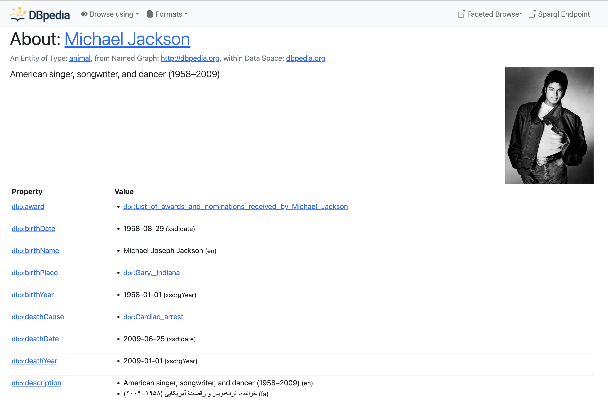

<style>
img.top-left {
  position: absolute;
  top: 2em;
  left: 2em;
  width: 300px; /* Adjust as needed */
}
.ipvs {
    color: var(--us-grey);
    position: absolute;
    top: 120px;
    left: 150px;
    word-spacing: normal;
    letter-spacing: normal;
    width: 300px;
    font-size: 13px;
}
</style>

<span class ="ipvs"> Institut für Parallele und Verteilte Systeme </span>

### **Conneting MetaConfigurator to the Semantic Web**

#### Master Thesis Introduction


Mahdi Jafarkhani
November 2025

---
# **Outline**

- **MetaConfigurator**
- **Semantic Web** 
- **Objectives**
    - **JSON to JSON-LD Transformation** 
    - **RDF-Authoring Panel**
    - **Knowledge Graph Visualization** 

---

<style scoped>
section {
  font-size: 30px;
}
</style>

# **MetaConfigurator**

- Model-Driven Engineering places models at the center of system and data engineering, typically expressed as schemas defining dataset structures and semantics.

- Many domains lack standardized models, making schema creation difficult for non-experts.

- **MetaConfigurator**, as an online tool combines LLMs with deterministic methods to support JSON Schema creation, modification, and mapping from natural language.

- The approach enables scalable, reliable schema mappings across heterogeneous data formats (JSON, CSV, XML, YAML).

- [Watch: AI-assisted JSON Schema Creation and Mapping](https://youtu.be/kexAkihcSCM)

---

<style scoped>
section {
  font-size: 28px;
}
</style>

# **Semantic Web**

- An extension of the current Web where data has meaning, not just format.

- Enables machines to understand, interpret, and combine information.

- Built on open standards from W3C.

- Core idea: turn the web into a global linked knowledge graph.

**Key benefits**

- Interoperability
- Reusability of data
- Automated reasoning
- Better integration across systems

---

<style scoped>
section {
  font-size: 32px;
}
</style>

# **Building Blocks of the Semantic Web**

- **RDF** (Resource Description Framework): A data model based on subject–predicate–object triples, to form graphs of linked data


- **RDFS & OWL**: Provide schemas and ontologies. Allows defining classes, properties, relationships


- **SPARQL**: Query language for RDF, Used to retrieve and manipulate graph data

---

<style scoped>

section {
  font-size: 30px;
  text-align: center
}
</style>

# **DBPedia, an exmaple on the Semantic Web**



---

# **Access data on the Semantic Web**

<style scoped>

section {
  font-size: 30px;
}
</style>

- List of Albums by Michael Jackson:

```sparql
PREFIX dbo: <http://dbpedia.org/ontology/>
PREFIX dbp: <http://dbpedia.org/property/>
PREFIX dbr: <http://dbpedia.org/resource/>
PREFIX rdfs: <http://www.w3.org/2000/01/rdf-schema#>

SELECT ?album ?albumLabel WHERE {
  ?album a dbo:Album ;
         dbp:artist dbr:Michael_Jackson .
  OPTIONAL { ?album rdfs:label ?albumLabel FILTER (lang(?albumLabel) = "en") }
}
ORDER BY ?albumLabel
```

---

# **Result**

<style scoped>

section {
  font-size: 20px;
}
</style>


```json
{
    "head": { ... },
    "results": {
        "bindings": [
            {
                "album": {
                    "type": "uri",
                    "value": "http://dbpedia.org/resource/Dangerous_(Michael_Jackson_album)"
                },
                "albumLabel": {
                    "type": "literal",
                    "xml:lang": "en",
                    "value": "Dangerous (Michael Jackson album)"
                }
            },
            {
                "album": {
                    "type": "uri",
                    "value": "http://dbpedia.org/resource/Bad_(album)"
                },
                "albumLabel": {
                    "type": "literal",
                    "xml:lang": "en",
                    "value": "Bad (album)"
                }
            },
            ...

```

---

# **JSON to JSON-LD Transformation** 

<style scoped>

section {
  font-size: 20px;
}
</style>

- **Add Semantic Meaning**
  - JSON is just data
  - JSON-LD adds **context**, turning data into **linked data**
  
- **Enable Interoperability**
  - Makes your data understandable across systems
  - Connects with other datasets using **shared vocabularies**  

- **Facilitate RDF Conversion**
  - JSON-LD can be directly mapped to **RDF triples**
  - Enables **SPARQL queries** and semantic reasoning  

- **Support Knowledge Graphs**
  - Data can be integrated into **global knowledge graphs** like DBpedia
  - Makes entities linkable and discoverable  

- **Compliance with Semantic Web Standards**
  - JSON-LD is W3C recommended
  - Aligns with **RML, SHACL, OWL** workflows

---

# **JSON to JSON-LD Transformation** 

<style scoped>

section {
  font-size: 18px;
}
</style>

```json
[
  {
    "name": "Michael Jackson",
    "birthPlace": "Gary, Indiana",
    "birthDate": "1958-08-29",
    "genre": "Pop"
  }
]
```
```json
{
  "@context": {
    "dbo": "http://dbpedia.org/ontology/",
    "dbr": "http://dbpedia.org/resource/",
    "rdfs": "http://www.w3.org/2000/01/rdf-schema#",
    "name": "http://xmlns.com/foaf/0.1/name",
    "birthPlace": "dbo:birthPlace",
    "birthDate": {
      "@id": "dbo:birthDate",
      "@type": "http://www.w3.org/2001/XMLSchema#date"
    },
    "genre": "dbo:genre"
  },
  "@id": "dbr:Michael_Jackson",
  "@type": "dbo:MusicalArtist",
  "name": "Michael Jackson",
  "birthPlace": "dbr:Gary,_Indiana",
  "birthDate": "1958-08-29",
  "genre": "dbr:Pop_music"
}

```

---
